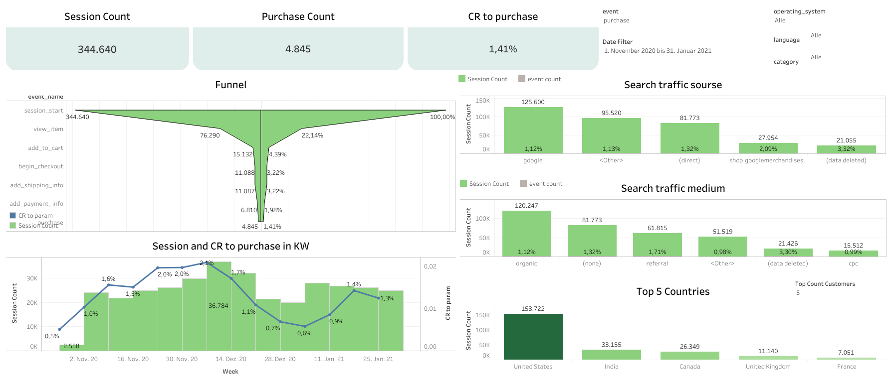

# E-Commerce Funnel Analysis & Dashboard

## Project Overview

This repository contains a comprehensive data analytics project designed to analyze user conversions, session behavior, and sales funnels for an e-commerce platform. Using the public Google Analytics 4 (GA4) dataset in **Google BigQuery** and interactive visualizations in **Tableau Public**, this project delivers a data-driven tool for marketing managers and strategists to identify drop-off points, evaluate traffic acquisition channels, and optimize conversion rates.

The project models real-world business tasks by transforming raw clickstream data into strategic insights that drive revenue growth and enhance user experience.

---

## Tech Stack & Tools

* **Data Warehouse & Querying:** Google BigQuery (SQL)
* **Data Visualization & Analytics:** Tableau Public
* **Dataset:** Public GA4 BigQuery Dataset (`bigquery-public-data.ga_sessions_*` / `ga4_obfuscated_sample_ecommerce`) [View Dataset](https://console.cloud.google.com/bigquery?p=bigquery-public-data&d=ga4_obfuscated_sample_ecommerce&t=events_20210131&page=table&project=elite-totality-489111-j4&ws=!1m6!1m5!4m3!1sbigquery-public-data!2sga4_obfuscated_sample_ecommerce!3sevents_20210131!23sLEGACY_URL_PARAM)
* **Repository & Version Control:** Git & GitHub

---

## Dataset Architecture & Data Challenges

* **Clickstream Event-Level Data:** The dataset captures granular user interactions (events) recorded across session timelines.
* **Nested Structures:** Session properties, traffic sources (`source`, `medium`, `campaign`), and device characteristics are nested within individual session records and event parameters.
* **Session-Level Dimensions:** Aggregations and conversions are evaluated primarily at the session level to reflect accurate user journeys across device categories, languages, operating systems, and landing pages.

---

## Step-by-Step Implementation

```
┌─────────────────────────┐     ┌─────────────────────────┐     ┌─────────────────────────┐
│  GA4 BigQuery Dataset   │ ──► │ SQL Data Transformation │ ──► │ Tableau Public Dashboard│
│   (Raw Event Logs)      │     │  (Aggregation & Logic)  │     │  (Interactive Insights) │
└─────────────────────────┘     └─────────────────────────┘     └─────────────────────────┘

```

1. **SQL Transformation & Data Preparation (BigQuery):**
* Cleaned raw event logs and extracted key session parameters (`landing_page`, `source`, `medium`, `campaign`, `device_category`, `device_language`, `operating_system`).
* Mapped event records into sequential funnel stages:
1. Session Start (`session_start`)
2. Product View (`view_item`)
3. Add to Cart (`add_to_cart`)
4. Begin Checkout (`begin_checkout`)
5. Add Shipping Info (`add_shipping_info`)
6. Add Payment Info (`add_payment_info`)
7. Purchase (`purchase`)


* Structured calculated fields for total sessions, total orders, and total revenue.


2. **Dashboard Design & Visualization (Tableau):**
* Built a funnel breakdown showcasing overall conversion progression across all 7 stages.
* Designed 5+ dynamic charts evaluating funnel efficiency by traffic sources, landing pages, and user device profiles.
* Incorporated session start time filters and cross-chart filtering capabilities.
* Applied UI/UX design standards: the **5-second rule**, strategic KPI placement at top-left, clear labeling, and functional color coding.


3. **Development & Review Timeline:**
* **Days 1–10:** Requirements planning, SQL data pipeline modeling, and initial Tableau dashboard layout.
* **Days 10–13:** Code and dashboard review by Project Mentors, incorporating feedback and refining SQL query efficiency.
* **Day 14:** Final review for edge-case errors and presentation slide deck preparation.
* **Day 15:** Final project presentation and demo to Technical Mentors and stakeholders.


---

## Project Deliverables

* **Interactive Tableau Dashboard:** [View E-Commerce Funnel Dashboard on Tableau Public](https://public.tableau.com/app/profile/oleksii.pidhornyi/viz/Ecommerce_funnel_17846667480820/Ecommerce_Funnel?utm_source=gemini)
* **BigQuery SQL Query:** Public SQL script used for data extraction and stage aggregation. [View sql](Request_Google_Cloud.sql).
* 
---

## Key Insights & Analytical Summary

### 1. Funnel Performance & Drop-Off Analysis

* **Overall Conversion Metrics:** Between November 1, 2020, and January 31, 2021, the platform recorded **344,640 sessions** and **4,845 completed purchases**, yielding a baseline conversion rate (**CR to purchase**) of **1.41%**.


* **Primary Drop-Off Point:** The most significant bottleneck occurs at the top of the funnel—only **22.14%** of sessions (76,290) progress from the initial entry (`session_start`) to viewing a product page (`view_item`). Approximately **78% of incoming traffic leaves the site without viewing a single item**.


* **Checkout Progression:**
* **Add to Cart (`add_to_cart`):** **4.39%** of overall sessions (15,132).


* **Begin Checkout (`begin_checkout`):** **3.22%** of overall sessions (11,088).


* **Shipping Information (`add_shipping_info`):** **3.22%** of overall sessions (11,087)—showing minimal friction from checkout initiation.


* **Payment Information (`add_payment_info`):** Conversion drops to **1.98%** (6,810 sessions).


* **Completed Purchase (`purchase`):** **1.41%** final conversion rate (4,845 sessions).


---

### 2. Weekly Session Trends & Conversion Dynamics

* **Q4 Peak Performance:** The highest conversion rates were achieved between late November and mid-December, peaking at **2.1%** during the week of December 14, 2020, alongside a volume high of **36,784 sessions**. This demonstrates strong engagement during major holiday promotions (Black Friday / Cyber Monday / Christmas sales).


* **Post-Holiday Slump:** Conversion rates sharply dropped in late December and early January to a low of **0.6%–0.7%** before steadily recovering to **1.3%–1.4%** by late January.


---

### 3. Traffic Source & Channel Efficiency

* **Volume vs. Quality:**
* **`google`** drives the highest overall session volume (**125,600 sessions**) but converts at a below-average rate of **1.12%**.


* **`(direct)`** traffic accounts for 81,773 sessions with a higher conversion rate of **1.32%**.


* **`referral`** traffic demonstrates superior quality, yielding a **1.71%** conversion rate across 61,815 sessions.


* **Targeted/Partner Links (`shop.googlemerchandises..`):** While generating a smaller footprint (27,954 sessions), this channel achieves a high conversion rate of **2.09%**.


---

### 4. Geographic Distribution

* **US Market Dominance:** The United States generates the vast majority of store traffic, accounting for **153,722 sessions** (~45% of total site traffic).


* **Secondary Markets:** Additional session volume is led by India (33,155), Canada (26,349), the United Kingdom (11,140), and France (7,051).


---

### 💡 Strategic Business Recommendations

1. **Landing Page Optimization:** Address the 78% initial bounce/drop-off rate by improving landing page relevance, visual hierarchy, page load speeds, and call-to-action (CTA) positioning above the fold.


2. **Streamline Payment Step:** Investigate the drop from shipping details (11,087) to payment submission (6,810) to identify potential issues such as limited payment options, unexpected shipping fees, or checkout UI friction.


3. **Reallocate Marketing Budget:** Re-evaluate paid acquisition strategies on broad channels like `google` to optimize ad spend toward higher-converting referral and targeted partner sources.